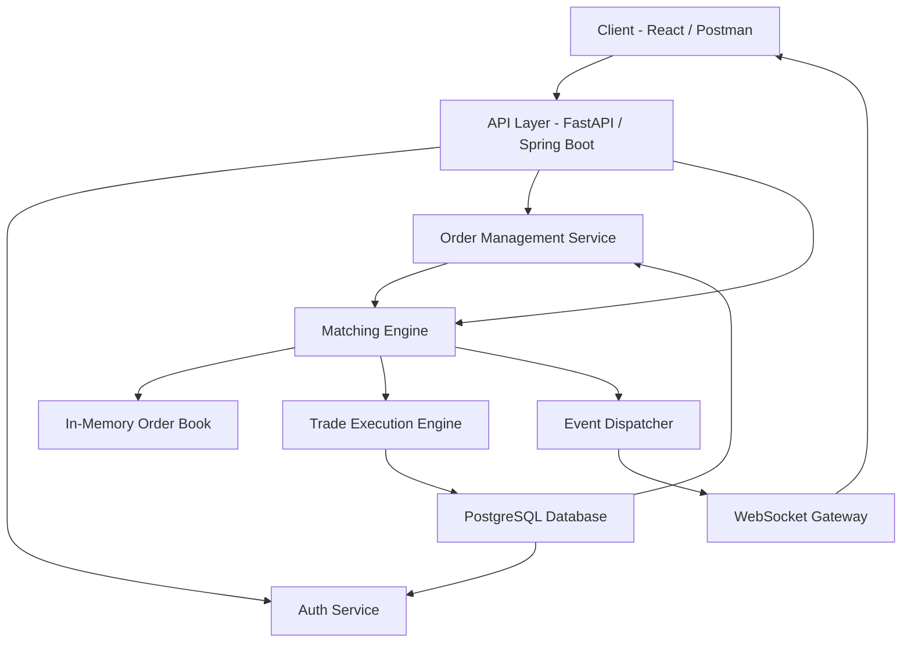
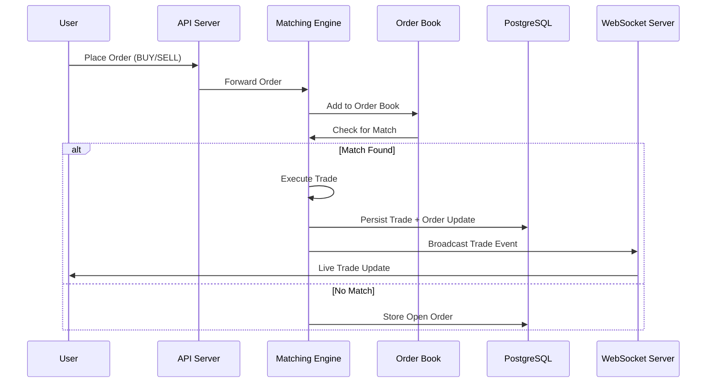

```markdown
# 🚀 Real-Time Distributed Trading Exchange Simulator

A high-performance backend-focused trading simulation platform that replicates core functionality of a financial exchange, including a custom order matching engine, real-time market updates, and portfolio tracking.

This project is designed to demonstrate **backend engineering, system design, concurrency handling, and fintech domain understanding**.

---

## 📌 Overview

This system simulates a simplified stock exchange where users can:
- Place buy/sell orders
- Trade virtual assets in real time
- View live order book updates
- Track portfolio performance

At its core is a **price-time priority matching engine**, similar to real-world trading systems.

---

## 🧠 Key Features

### ⚙️ Core Trading Engine
- Limit and market orders
- Price-time priority order matching
- Partial order fills
- Order cancellation support
- Multi-symbol trading (e.g., AAPL, TSLA)

### 📊 Real-Time System
- WebSocket-based live updates
- Live order book changes
- Trade execution broadcasts
- Real-time price updates

### 👤 User System
- User registration and authentication
- Cash balance management
- Portfolio tracking (holdings per asset)

### 📦 Data & Persistence
- PostgreSQL for persistent storage
- Orders, trades, and user data tracking
- Event logging for trade history

---

## 🏗️ System Architecture



```

Client (React / Web UI)
↓
REST API (FastAPI / Spring Boot)
↓
Matching Engine (In-Memory, High Speed)
↓
Database (PostgreSQL)
↓
WebSocket Gateway (Real-Time Updates)

```

### Core Design Principles
- In-memory order book for low-latency execution
- Event-driven trade processing
- Separation of API layer and matching engine
- Concurrent-safe order processing

---

## ⚡ Matching Engine Logic

The system uses a **price-time priority algorithm**:

- Buy orders sorted by:
  - Highest price first
  - Earliest timestamp second

- Sell orders sorted by:
  - Lowest price first
  - Earliest timestamp second

### Execution Rule:
A trade executes when:
```

buy_price >= sell_price

````

Partial fills are supported until orders are fully matched.

---

## 🧱 Tech Stack

### Backend
- Python (FastAPI) / Java (Spring Boot)
- WebSockets (real-time communication)
- Async processing (optional)

### Database
- PostgreSQL

### Optional Enhancements
- Redis (pub/sub, caching)
- Docker (containerization)
- Kafka (event streaming for advanced version)

### Frontend (optional)
- React
- Trading dashboard UI
- Live order book visualization

---

## 🗂️ Data Model

### Users
- id
- username
- password_hash
- cash_balance

### Orders
- id
- user_id
- symbol
- side (BUY / SELL)
- price
- quantity
- status (OPEN / PARTIAL / FILLED / CANCELLED)
- timestamp

### Trades
- id
- buy_order_id
- sell_order_id
- symbol
- price
- quantity
- timestamp

---

## 🔄 Example Workflow

1. User places BUY order for AAPL at $150
2. Another user places SELL order at $149
3. Matching engine detects overlap
4. Trade executes instantly at matched price
5. Portfolio and order book update
6. WebSocket broadcasts update to clients

---

## 📡 Real-Time Updates

Clients receive live updates via WebSockets:
- Order book changes
- Trade executions
- Price updates
- Portfolio changes

---

## 🧪 Advanced Features (Planned / Optional)

- Risk management system (margin limits, exposure caps)
- Latency benchmarking for matching engine
- Order replay system (reconstruct market state)
- Distributed matching engine (sharding by symbol)
- Kafka-based event streaming pipeline

---

## 🚀 Deployment

### Run locally

```bash
# Backend
pip install -r requirements.txt
uvicorn app.main:app --reload

# Database
docker-compose up -d postgres
````

---

## 📈 Why This Project Matters

This project demonstrates:

* Backend system design
* High-performance in-memory processing
* Real-world fintech architecture concepts
* Concurrency-safe engineering
* API + real-time system integration

It is directly relevant to roles in:

* Fintech engineering
* Backend software engineering
* Trading infrastructure teams

---

## 📷 Future Improvements

* Add React trading dashboard
* Add candlestick chart visualization
* Introduce simulated market volatility engine
* Add authentication with OAuth2 / JWT refresh tokens
* Deploy to cloud (AWS / GCP)

---

## 🧑‍💻 Author

Built as a capstone project to demonstrate production-level backend engineering and fintech system design skills.

---
